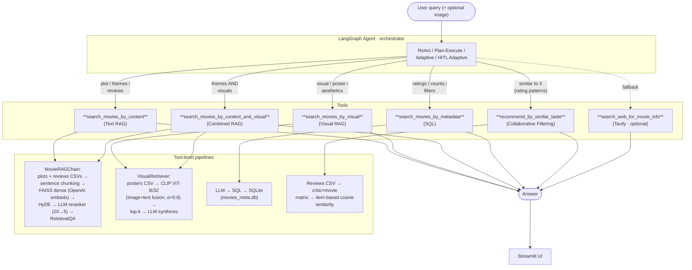

# Movie RAG

[](https://github.com/sirandou/movie-rag/actions/workflows/ci.yml)
[](https://www.python.org/downloads/)
[](LICENSE)

A multimodal Retrieval-Augmented Generation system over 8,000+ movies with critic reviews, plot summaries, poster images, and structured metadata. A LangGraph agent orchestrates five specialised tools — text RAG, visual RAG, combined multimodal RAG, SQL, and collaborative filtering (plus optional web search) — each backed by its own index and data format, and four agent variants (ReAct → HITL Adaptive) give a spectrum of autonomy vs. control.

## Architecture

The agent is a pure orchestrator — it chooses a tool per query; each tool owns its own data, index, and synthesis logic.



> A free Excalidraw version is planned — use the Mermaid source above as reference.

## Tech Stack

| Layer | Technology |
|---|---|
| Agent framework | LangGraph |
| RAG framework | LangChain |
| LLM | OpenAI `gpt-4o-mini` |
| Text embeddings | OpenAI `text-embedding-3-small` |
| Visual embeddings | OpenAI CLIP ViT-B/32 |
| Dense index | FAISS (flat) |
| Reranker | LLM-based (0-10 relevance scoring) — cross-encoder & Cohere also supported |
| Query transformation | HyDE |
| Metadata store | SQLite |
| Web search | Tavily |
| Evaluation | RAGAS |
| UI | Streamlit |
| Tracing | LangSmith (optional) |

## Quick Start

### 1. Clone and install

```bash
git clone git@github.com:sirandou/movie-rag.git
cd movie-rag

# Conda env (Python 3.12)
conda env create -f environment.yml
conda activate movie-rag

# Install everything (base + ML + RAG + agents + dev tools)
make install-all
```

### 2. Configure API keys

```bash
export OPENAI_API_KEY="..."
export OMDB_API_KEY="..."
export TAVILY_API_KEY="..."

# Optional — LangSmith tracing
export LANGCHAIN_API_KEY="..."
export LANGCHAIN_TRACING_V2="true"
```

### 3. Prepare datasets

Follow [datasets/rotten-tomatoes-reviews/README.md](datasets/rotten-tomatoes-reviews/README.md), then run the scripts in `notebooks/data_prep/` to build the SQLite DB and download posters.

### 4. Launch the UI

```bash
streamlit run app.py
```

Configure the agent type and dataset paths in the sidebar, click **Initialize Pipeline**, then ask questions.

## Example Queries

Each example shows which tool the agent is expected to route to.

| Query | Routed tool | Why |
|---|---|---|
| *"What themes are in Interstellar?"* | `search_movies_by_content` | Plot/theme question → text RAG over plots + reviews |
| *"Recommend a sci-fi movie with time travel"* | `search_movies_by_content` | Semantic match against plots; HyDE helps for vague prompts |
| *"Find movies that look like Blade Runner"* | `search_movies_by_visual` | Visual style → CLIP poster search |
| *"Dark themed sci-fi with neon visuals"* | `search_movies_by_content_and_visual` | Needs both modalities |
| *"Top 10 horror movies from the 90s with ≥100 reviews"* | `search_movies_by_metadata` | Structured filter → SQL |
| *"I loved Inception and Memento, what else would I like?"* | `recommend_by_similar_taste` | Item-based CF over critic rating patterns |
| *"Compare Tarantino's and Scorsese's directorial styles"* | Plan-Execute → `search_movies_by_content` (+ web search fallback) | Multi-step; adaptive agent falls back to Tavily if local reviews are thin |
| *"Which movie has this poster?"* + image | `search_movies_by_visual` | CLIP image-to-movie matching |

Each agent type handles these differently:
- **ReAct** — one-shot reason-act-observe loop, good for simple queries
- **Plan-Execute** — decomposes into steps, executes sequentially, good for compound queries
- **Adaptive Plan-Execute** — Plan-Execute + automatic retry, web-search fallback, LLM-driven replanning on failure
- **HITL Adaptive** — pauses and asks for human guidance when automatic recovery fails (refine / skip / accept / replan / stop)

## RAGAS Evaluation

Ran in `notebooks/9-selfrag-ragas.ipynb` over 5 held-out movie questions, comparing the minimal chain against the full app-default chain.

| Chain variant | Avg Faithfulness | Avg Answer Relevancy† |
|---|---|---|
| Basic (dense, no HyDE, no rerank) | **0.88** | 0.97 |
| Full (dense + HyDE + LLM reranker) — **app default** | **0.89** | 0.96 |

† Two questions scored 0.0 on answer relevancy due to RAGAS evaluation instability on ambiguous queries; averages above exclude those outliers. Context precision and recall were not computed (no ground-truth context labels).

**Interpretation**: for this domain the baseline already answers well. HyDE + reranking lifts faithfulness by ~1% on one question, useful for vague queries but not universally a win.

## Key Design Decisions

### Dense + HyDE over hybrid, in the app default

The repo implements hybrid (FAISS + BM25, configurable `alpha`), sparse (BM25), and dense retrieval, but the app pins `retriever_config={"type": "dense"}`. The rationale: movie questions in this dataset are usually thematic or descriptive, where dense semantic similarity beats keyword overlap. To close the gap on vague queries, HyDE generates a hypothetical answer first and searches with that — this is cheaper and more effective here than tuning a hybrid `alpha`. Hybrid remains one flag away for queries that require exact-keyword recall (niche titles, cast names).

### LLM reranker over cross-encoder, in the app default

Three rerankers are supported — cross-encoder (`ms-marco-MiniLM-L-6-v2`), Cohere, and LLM (`gpt-4o-mini` scoring docs 0-10). The LLM reranker wins on quality for this domain at the cost of latency: it can weigh nuanced relevance (e.g. "is this review actually about the plot?") that the off-the-shelf cross-encoder misses, and we already have an LLM in the request path. For throughput-sensitive deployments, switch to cross-encoder with no other change.

### LangGraph over vanilla LangChain agents

LangChain's legacy `AgentExecutor` is a black-box loop. LangGraph exposes the agent as an explicit state machine, enabling conditional edges (retry-on-failure, web-search fallback, pause-for-human). All four agent variants share the same tool set and differ only in graph topology — adding HITL was an edge and a node, not a rewrite.

### Multiple specialised tools over one generic RAG tool

A single "search movies" tool would force the LLM to cram orthogonal query types (plot themes vs. visual style vs. numeric filters vs. rating similarity) through one retriever. Instead, each tool's docstring clearly scopes its use case, the LLM picks the right one, and each tool uses the indexing and synthesis prompt appropriate to its data format. This is closer to a router pattern than a monolithic retriever.

### Sentence-based chunking over fixed token size

`use_custom_chunk=True` in the app calls `chunking_strategy="sentence"`, which groups 5 sentences per chunk and treats each review as a natural chunking boundary. Fixed 200-token chunks fragmented reviews mid-sentence; 800-token chunks (still available via `use_custom_chunk=False`) diluted precision. Sentence chunking preserves review integrity and gives retrieval a cleaner unit to score. Semantic chunking is also implemented (cosine-similarity threshold) but was not a net win in practice.

### CLIP with weighted-average image+text fusion (α=0.8)

The visual retriever encodes both posters and their text descriptions with CLIP and fuses them (0.8 image + 0.2 text). Pure poster embeddings missed title/genre context; pure text embeddings ignored the visual prompt. α=0.8 keeps visual queries visual-first but lets the title/metadata disambiguate near-duplicate posters.

## Repository feature catalog

Beyond the app-default pipeline, the repo implements a broader set of retrievers, chain variants, and evaluation patterns — mostly explored in numbered notebooks. None of these are wired into `app.py`, but they're all available for experimentation.

### Datasets

- **8,000+ movies** with critic reviews from Rotten Tomatoes
- **6,000+ plot summaries** from OMDB
- **6,000+ poster images** from OMDB
- **SQLite database** with structured movie metadata (ratings, genres, cast, etc.)

### Retrievers (`src/retrievers/`)

| Retriever | Backends / Options |
|---|---|
| Dense | FAISS (flat / IVF) or in-memory; Sentence-Transformers or OpenAI embeddings |
| Sparse | BM25 (configurable `k1`, `b`) |
| Hybrid | Weighted dense + sparse, configurable `alpha` |
| Visual | CLIP ViT-B/32; concat or weighted-average fusion of image + text |

### Chunking strategies (`src/data/chunk.py`)

- **Fixed token** — tiktoken-based, configurable size + overlap (default 200 / 50)
- **Sentence** — NLTK sentence tokenisation, N sentences per chunk (default 5), review-aware
- **Semantic** — sentence-similarity threshold (default 0.7) using all-MiniLM-L6-v2

### RAG chains and patterns (`src/langchain/`)

- **Text RAG** (`chains/movie_rag.py`) — the core MovieRAGChain, composable with any retriever + HyDE + reranker
- **Multimodal RAG** (`chains/multimodal.py`) — full text + visual chain with image inputs
- **Self-RAG** (`chains/self_rag.py`) — self-critique and refinement loop
- **Streaming** (`chains/streaming.py`) — token-by-token streaming responses
- **HyDE** (`retrieval/hyde.py`) — hypothetical-answer query expansion
- **Rerankers** (`retrieval/reranker.py`) — cross-encoder / Cohere / LLM
- **RAGAS** (`ragas.py`) — faithfulness, answer relevancy, context metrics
- **LangSmith** (`observability.py`) — tracing setup

### Agents (`src/agents/`)

| Agent | Use case |
|---|---|
| **ReAct** | Simple queries; reason-act-observe loop |
| **Plan-Execute** | Multi-step queries; decomposes then executes sequentially |
| **Adaptive Plan-Execute** | Auto-retry, web-search fallback, LLM-driven replanning |
| **HITL Adaptive** | All adaptive features + interactive human intervention |

All four share the same tools (text RAG, visual RAG, combined RAG, SQL, collaborative filtering, and optional web search) via `src/agents/base_movie_agent.py`.

### Notebooks

Numbered 1–12 in `notebooks/` showing progressive feature development:
embeddings → chunking → text retrieval → BM25 → visual retrieval → LangChain RAG → reranking → HyDE/streaming/LangSmith → Self-RAG/RAGAS → multimodal chain → ReAct agent → Plan-Execute agent. `notebooks/data_prep/` contains one-time dataset preparation.

## Project Structure

```
src/
├── data/           # Document creators, chunking, SQLite DB
├── retrievers/     # Dense, sparse, hybrid, visual retrievers + factory
├── langchain/
│   ├── chains/     # MovieRAGChain, multimodal, self-RAG, streaming
│   ├── retrieval/  # HyDE, reranker, retriever wrappers
│   ├── prompts.py  # System prompts (QA, visual, combined, SQL, planning)
│   ├── observability.py  # LangSmith tracing
│   └── ragas.py    # RAGAS evaluation
├── agents/
│   ├── react.py
│   ├── plan_execute.py
│   ├── adaptive_plan_execute.py
│   ├── hitl_adaptive_plan_execute.py
│   ├── base_movie_agent.py
│   └── tools/      # multimodal_rag, sql_tool, collaborative_filtering, web_search
└── utils/          # Embedding models, LLM utilities

notebooks/          # Progressive demos (1–12) + data_prep scripts
datasets/           # Source data and preparation instructions
app.py              # Streamlit UI entry point
tests/              # pytest test suite
```

## Development

```bash
make test           # Run all tests (pytest)
make format         # Ruff format + lint
make jupyter        # Start Jupyter Lab
make clean          # Remove cache and temp files
make setup-hooks    # Install pre-commit hooks
```

Poetry dependency groups (`pyproject.toml`):

- `base` — numpy, pandas, scikit-learn, matplotlib
- `ml` — torch, lightning, wandb
- `rag-agent` — langchain, langgraph, faiss, sentence-transformers, clip, ragas, tavily
- `dev` — pytest, ruff, black, mypy, isort

```bash
poetry add --group <group> <package>
```

## License

MIT © 2025 Saghar Irandoust

Data sources:
- [Rotten Tomatoes Movies and Critic Reviews Dataset](https://www.kaggle.com/datasets/stefanoleone992/rotten-tomatoes-movies-and-critic-reviews-dataset) (Kaggle)
- OMDB API for plot summaries and poster images (free or paid API key)
- [Hugging Face](https://huggingface.co/) for Sentence-Transformers and CLIP (free)
- OpenAI API for embeddings and LLM (paid)
