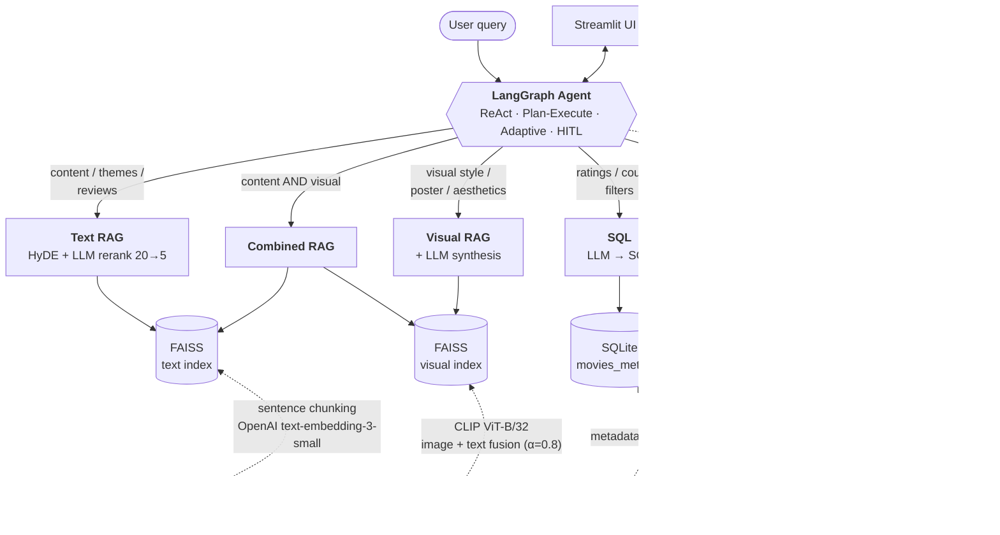

# 🎬 Movie RAG

[](https://github.com/sirandou/movie-rag/actions/workflows/ci.yml)
[](https://www.python.org/downloads/)
[](LICENSE)
[](https://github.com/langchain-ai/langgraph)
[](https://github.com/langchain-ai/langchain)

A multimodal Retrieval-Augmented Generation system over 8,000+ movies with critic reviews, plot summaries, posters, and structured metadata. A LangGraph agent routes each query to one of six specialised tools — text RAG, visual RAG, combined multimodal RAG, SQL, collaborative filtering, and web search. Four agent variants (ReAct → HITL Adaptive) offer a spectrum of autonomy.

---

## Architecture

Solid arrows show the request path at query time. Dashed arrows show the offline indexing pipelines that populate each store.



## Tech Stack

| Layer | Technology |
|---|---|
| Agent framework | **LangGraph** |
| RAG framework | **LangChain** |
| LLM | OpenAI `gpt-4o-mini` |
| Text embeddings | OpenAI `text-embedding-3-small` |
| Visual embeddings | OpenAI CLIP ViT-B/32 |
| Dense index | FAISS (flat) |
| Reranker | LLM-based 0–10 relevance scoring |
| Query transformation | HyDE |
| Metadata store | SQLite |
| Web search | Tavily |
| Evaluation | RAGAS |
| UI | Streamlit |
| Tracing | LangSmith (optional) |

## Quick Start

```bash
# 1. Clone and install
git clone git@github.com:sirandou/movie-rag.git
cd movie-rag
conda env create -f environment.yml
conda activate movie-rag
make install-all

# 2. Export API keys
export OPENAI_API_KEY="..."
export OMDB_API_KEY="..."
export TAVILY_API_KEY="..."

# 3. Prepare datasets (see datasets/rotten-tomatoes-reviews/README.md)
#    then run scripts in notebooks/data_prep/

# 4. Launch the UI
streamlit run app.py
```

## Development

```bash
make test            # pytest
make format          # Ruff format + lint
make jupyter         # Start Jupyter Lab
make clean           # Remove cache and temp files
make setup-hooks     # Install pre-commit hooks
```

Poetry dependency groups (`pyproject.toml`):

| Group | Contents |
|---|---|
| `base` | numpy, pandas, scikit-learn, matplotlib |
| `ml` | torch, lightning, wandb |
| `rag-agent` | langchain, langgraph, faiss, sentence-transformers, clip, ragas, tavily |
| `dev` | pytest, ruff, black, mypy, isort |

```bash
poetry add --group <group> <package>
```

## Example Queries

| Query | Routes to | Notes |
|---|---|---|
| *What themes are in Interstellar?* | Text RAG | Plot + review retrieval |
| *Recommend a sci-fi movie with time travel* | Text RAG | HyDE helps with vague prompts |
| *Find movies that look like Blade Runner* | Visual RAG | CLIP poster search |
| *Dark sci-fi films with neon visuals* | Combined RAG | Needs both modalities |
| *Top 10 horror movies from the 90s with ≥100 reviews* | SQL | Structured filtering |
| *I loved Inception and Memento — what else would I like?* | Collaborative Filtering | Item-based over critic ratings |
| *Compare Tarantino's and Scorsese's directorial styles* | Plan-Execute → Text RAG (+ web fallback) | Multi-step reasoning |
| *Which movie has this poster?* + image | Visual RAG | Image-to-movie matching |

### Agent Variants

| Agent | Behaviour |
|---|---|
| **ReAct** | Single reason–act–observe loop |
| **Plan-Execute** | Decomposes the query into steps and executes them sequentially |
| **Adaptive Plan-Execute** | Adds automatic retry, web-search fallback, and LLM-driven replanning on failure |
| **HITL Adaptive** | Pauses on unrecoverable failure and asks the user to refine, skip, accept, replan, or stop |

## Evaluation

Exploratory RAGAS runs over a small 5-question set live in [`notebooks/9-selfrag-ragas.ipynb`](notebooks/9-selfrag-ragas.ipynb), comparing the basic dense chain, dense + HyDE + LLM rerank, and a Self-RAG wrapper. Faithfulness and answer relevancy look comparable across variants on recommendation questions; the basic chain returns non-answers on the analytical prompts (Nolan's style, Tarantino vs Scorsese), which HyDE + rerank partially recovers. Context precision and recall could not be computed. A larger held-out set is the natural next step before drawing conclusions.

## Features

### Datasets

- 8,000+ movies with Rotten Tomatoes critic reviews
- 6,000+ plot summaries and poster images from OMDB
- SQLite database of structured metadata (ratings, genres, cast, years)

### Retrievers (`src/retrievers/`)

| Retriever | Options |
|---|---|
| Dense | FAISS (flat / IVF) or in-memory; Sentence-Transformers or OpenAI embeddings |
| Sparse | BM25 (`k1`, `b` configurable) |
| Hybrid | Weighted dense + sparse, configurable `alpha` |
| Visual | CLIP ViT-B/32; concat or weighted-average fusion |

### Chunking Strategies (`src/data/chunk.py`)

- **Sentence** — NLTK sentence tokenisation, N sentences per chunk, review-aware
- **Fixed token** — tiktoken-based, configurable size + overlap
- **Semantic** — sentence-similarity threshold using `all-MiniLM-L6-v2`

### RAG Patterns (`src/langchain/`)

- Text RAG (`chains/movie_rag.py`) — composable with any retriever + HyDE + reranker
- Multimodal RAG (`chains/multimodal.py`) — text + visual with image inputs
- Self-RAG (`chains/self_rag.py`) — self-critique and refinement loop
- Streaming (`chains/streaming.py`) — token-by-token responses
- HyDE (`retrieval/hyde.py`) — hypothetical-answer query expansion
- Rerankers (`retrieval/reranker.py`) — cross-encoder, Cohere, or LLM
- RAGAS (`ragas.py`) — faithfulness, answer relevancy, context metrics
- LangSmith (`observability.py`) — tracing setup

### Agent Tools (`src/agents/tools/`)

| Tool | Data | Synthesis |
|---|---|---|
| `search_movies_by_content` | FAISS text index | `MovieRAGChain` (HyDE + rerank + RetrievalQA) |
| `search_movies_by_visual` | FAISS visual index | CLIP search + LLM |
| `search_movies_by_content_and_visual` | Both indices | LLM combines both |
| `search_movies_by_metadata` | SQLite | LLM generates SQL, executes, formats |
| `recommend_by_similar_taste` | CF similarity matrix | Item-based cosine + critic filter |
| `search_web_for_movie_info` | Tavily API | LLM synthesises from web results |

### Notebooks

Numbered 1–12 in [`notebooks/`](notebooks/): embeddings → chunking → text retrieval → BM25 → visual retrieval → LangChain RAG → reranking → HyDE & streaming → Self-RAG & RAGAS → multimodal chain → ReAct agent → Plan-Execute agent. Dataset preparation scripts live in [`notebooks/data_prep/`](notebooks/data_prep/).

## Project Structure

```
src/
├── data/           # Document creators, chunking, SQLite DB
├── retrievers/     # Dense, sparse, hybrid, visual + factory
├── langchain/
│   ├── chains/     # MovieRAGChain, multimodal, self-RAG, streaming
│   ├── retrieval/  # HyDE, rerankers, retriever wrappers
│   ├── prompts.py
│   ├── observability.py
│   └── ragas.py
├── agents/
│   ├── react.py
│   ├── plan_execute.py
│   ├── adaptive_plan_execute.py
│   ├── hitl_adaptive_plan_execute.py
│   ├── base_movie_agent.py
│   └── tools/      # multimodal_rag, sql_tool, collaborative_filtering, web_search
└── utils/          # Embedding models, LLM utilities

notebooks/          # Progressive demos (1–12) + data_prep
datasets/           # Source data + preparation instructions
tests/              # Pytest suite
app.py              # Streamlit UI
```

## Key Design Decisions

- **Dense + HyDE over hybrid.** Thematic queries dominate this dataset; HyDE closes the gap on vague prompts more cheaply than tuning a BM25/dense mix. Hybrid and sparse remain available via `retriever_config`.
- **LLM reranker over cross-encoder.** Captures nuanced relevance (*is this review actually about the plot?*) and reuses the LLM already in the request path. Cross-encoder and Cohere are drop-in alternatives.
- **LangGraph over `AgentExecutor`.** Explicit state machines make retry edges, fallbacks, and HITL pauses first-class. All four agent variants share the same tools and differ only in graph topology.
- **Specialised tools over one generic retriever.** Orthogonal query types (plot, visual, numeric, taste) each get an index and synthesis prompt suited to their format.
- **Sentence-based chunking.** Respects review boundaries; fixed token chunks fragmented or diluted context.
- **CLIP image+text fusion (α=0.8).** Title/genre context resolves ambiguous posters while keeping visual queries visual-first.

## License

MIT © 2025 Saghar Irandoust

**Data & models:** [Rotten Tomatoes dataset](https://www.kaggle.com/datasets/stefanoleone992/rotten-tomatoes-movies-and-critic-reviews-dataset) (Kaggle) · OMDB API · [Hugging Face](https://huggingface.co/) (Sentence-Transformers, CLIP) · OpenAI API
