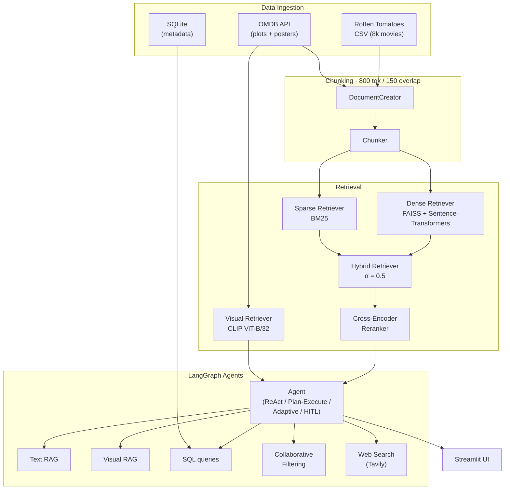

# Movie RAG

[](https://github.com/sirandou/movie-rag/actions/workflows/ci.yml)
[](https://www.python.org/downloads/)
[](LICENSE)

A multimodal Retrieval-Augmented Generation system for querying 8,000+ movies using critic reviews, plot summaries, and poster images. Built on a hybrid FAISS + BM25 retriever with cross-encoder reranking, and exposed through a hierarchy of LangGraph agents — from a simple ReAct loop up to a Human-in-the-Loop adaptive planner — backed by SQL, collaborative filtering, and live web search.

## Architecture



> **Excalidraw version** — open [excalidraw.com](https://excalidraw.com) and use the Mermaid diagram above as a reference to draw a styled version.

## Tech Stack

| Layer | Technology |
|---|---|
| LLM + Embeddings | OpenAI GPT-4o-mini, text-embedding-3-small |
| Local Embeddings | Sentence-Transformers all-MiniLM-L6-v2 |
| Visual Embeddings | OpenAI CLIP ViT-B/32 |
| Dense Index | FAISS |
| Sparse Index | BM25 (rank-bm25) |
| Reranker | Cohere or sentence-transformers cross-encoder |
| Agent Framework | LangGraph |
| RAG Framework | LangChain |
| Evaluation | RAGAS |
| Database | SQLite |
| UI | Streamlit |
| Tracing | LangSmith |

## Quick Start

### 1. Clone and install

```bash
git clone git@github.com:sirandou/movie-rag.git
cd movie-rag

# Create conda environment
conda env create -f environment.yml
conda activate movie-rag

# Install all dependencies (base + ML + RAG + agents)
make install-all
```

### 2. Set API keys

```bash
export OPENAI_API_KEY="..."
export OMDB_API_KEY="..."
export TAVILY_API_KEY="..."

# Optional: LangSmith tracing
export LANGCHAIN_API_KEY="..."
export LANGCHAIN_TRACING_V2="true"
```

### 3. Prepare datasets

Follow [datasets/rotten-tomatoes-reviews/README.md](datasets/rotten-tomatoes-reviews/README.md) to download and prepare the source data, then run the notebooks in `notebooks/data_prep/` to build the SQLite DB and download posters.

### 4. Run the UI

```bash
streamlit run app.py
```

Configure the agent type and dataset paths in the sidebar, click **Initialize**, then submit queries.

## Example Queries

| Query | Agent | Expected behaviour |
|---|---|---|
| *"What are some good Christopher Nolan films?"* | ReAct | Text RAG retrieves reviews + plots; returns ranked list with justification |
| *"Find me a sci-fi movie with time travel"* | ReAct | Hybrid retriever finds thematic matches across plots and reviews |
| *"Which movie has this poster?"* + image | ReAct | CLIP visual retriever matches poster embedding; returns title + metadata |
| *"Recommend something similar to Inception based on critic taste"* | ReAct | Collaborative filtering computes cosine similarity over critic rating vectors |
| *"What are the top-rated horror movies from the 90s with at least 100 reviews?"* | Plan-Execute | Planner decomposes into SQL (filter by genre/year/count) + RAG (enrich with reviews) |
| *"Compare Tarantino's and Scorsese's directorial styles"* | Adaptive | Multi-step plan; falls back to web search if local reviews are thin |

## RAGAS Evaluation

Evaluation ran over 5 held-out movie questions using `notebooks/9-selfrag-ragas.ipynb`.

| Chain variant | Avg Faithfulness | Avg Answer Relevancy |
|---|---|---|
| Basic (no HyDE, no rerank) | **0.88** | 0.97* |
| Full (HyDE + LLM reranker) | **0.89** | 0.96* |

\* Two questions scored 0.0 on answer relevancy due to RAGAS evaluation instability on ambiguous queries; scores above exclude those outliers.

Context precision and recall could not be computed reliably without ground-truth context labels.

## Key Design Decisions

### Hybrid retrieval over dense-only

Pure dense retrieval misses exact title matches, actor names, and rare keywords that BM25 handles trivially. A 50/50 hybrid (`alpha=0.5`) captures both semantic similarity and keyword overlap. The `alpha` parameter is configurable so you can tune the trade-off per use case without changing code.

### Cross-encoder reranking

The hybrid retriever retrieves `k=20` candidates cheaply, then a cross-encoder reranks them to return the top `k=5`. Cross-encoders score query–document pairs jointly rather than independently, which substantially improves precision at the cost of latency — a worthwhile trade for a conversational QA system where answer quality matters more than throughput.

### LangGraph over vanilla LangChain agents

LangChain's legacy `AgentExecutor` is a black-box loop with limited control. LangGraph exposes the agent as an explicit state machine, making it easy to add conditional edges (retry on failure, branch to web search, pause for human input) and to inspect intermediate state for debugging. The four agents in this repo share the same tool set but differ only in their graph topology.

### Chunk size rationale

Reviews and plot summaries are mid-length prose. At 800 tokens with 150-token overlap, each chunk fits a full paragraph or scene description without splitting a sentence across chunks. Smaller chunks (~200 tokens) produced incomplete context; larger chunks diluted retrieval precision. The 150-token overlap ensures boundary sentences appear in at least one chunk's context window.

### RAGAS scores

HyDE + reranking improved faithfulness by ~1% on average but did not consistently help answer relevancy. For this domain (movie QA), the baseline hybrid retriever is already high-quality, so the added latency of HyDE is only worth enabling for exploratory or vague queries.

## Project Structure

```
src/
├── data/           # Document creation, chunking, SQLite DB
├── retrievers/     # Dense, sparse, hybrid, visual retrievers
├── langchain/      # RAG chains, HyDE, reranker, prompts, RAGAS
├── agents/         # ReAct, Plan-Execute, Adaptive, HITL agents
│   └── tools/      # SQL, collaborative filtering, web search, RAG tools
└── utils/          # Embedding models, LLM utilities

notebooks/          # Progressive demos (1–12) + data_prep scripts
datasets/           # Source data and preparation instructions
app.py              # Streamlit UI entry point
```

## Development

```bash
make test           # Run all tests
make format         # Ruff format + lint
make jupyter        # Start Jupyter Lab
make clean          # Remove cache and temp files
make setup-hooks    # Install pre-commit hooks
```

## License

MIT © 2025 Saghar Irandoust

Data sources: [Rotten Tomatoes dataset](https://www.kaggle.com/datasets/stefanoleone992/rotten-tomatoes-movies-and-critic-reviews-dataset) (Kaggle) · OMDB API · Hugging Face models (free) · OpenAI API (paid)
